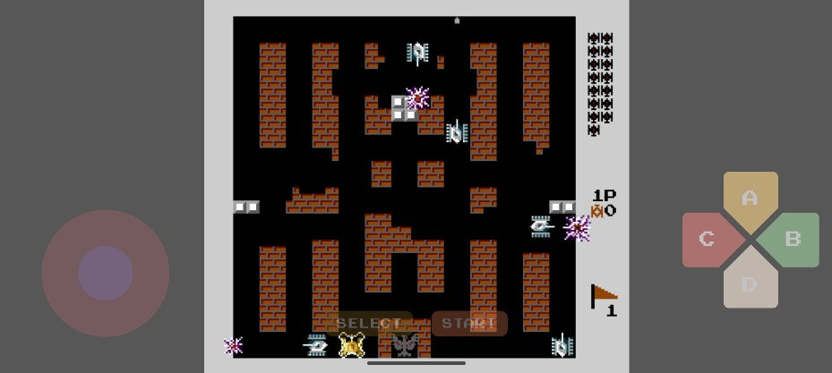

# BattleCity for Android

本项目是一个 Android 应用，内置了基于 H5 的离线版《Battle City》（坦克大战）游戏，复刻度高达 95%+，致敬经典童年回忆。

## 项目简介

- **平台**：Android
- **核心功能**：通过 WebView 加载本地 H5 资源，实现原汁原味的坦克大战游戏体验。
- **H5 资源**：所有游戏资源均打包在 `app/src/main/assets/` 目录下，支持离线运行。

## 主要目录结构

```
BattleCity/
├── app/
│   └── src/
│       └── main/
│           ├── assets/      # H5 游戏资源（index.html、img、audio等）
│           ├── java/com/hec9527/battlecity/  # Android 代码
│           └── res/layout/activity_main.xml  # WebView 布局
├── build.gradle.kts
├── settings.gradle.kts
└── readme.md
```

## 运行方式

1. **环境要求**
   - Android Studio
   - Android SDK 33 及以上

2. **编译与运行**
   - 使用 Android Studio 打开本项目
   - 连接 Android 设备或启动模拟器
   - 点击"运行"按钮即可安装并启动游戏

3. **游戏入口**
   - 应用启动后自动加载本地 H5 游戏资源，进入游戏主界面

## 相关说明

- 本项目仅用于学习与交流，禁止用于商业用途。
- 游戏资源和代码均为复刻与自制，若有侵权请联系删除。

## 截图




## 致谢

- 致敬H5版battleCity的开发者 👉🏻 [Battle City H5项目地址💐💐💐](https://github.com/hec9527/BattleCity) 
- 感谢所有开源社区的支持
